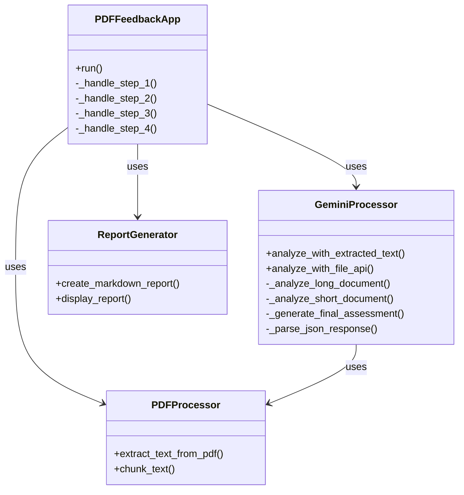
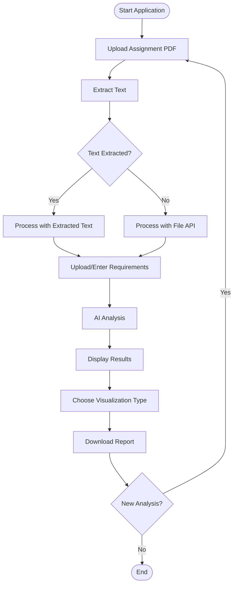
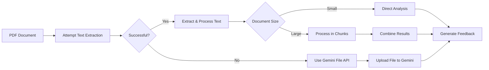

# AI PDF Feedback System

An advanced, AI-powered system for providing comprehensive feedback on academic assignments by evaluating student work against assignment requirements.

## 📋 Table of Contents

- [Overview](#overview)
- [Key Features](#key-features)
- [Architecture](#architecture)
- [System Flow](#system-flow)
- [Installation](#installation)
- [Usage Guide](#usage-guide)
- [Class Structure](#class-structure)
- [PDF Processing Strategies](#pdf-processing-strategies)
- [Visualization Options](#visualization-options)
- [Customization](#customization)
- [Environmental Variables](#environmental-variables)
- [Troubleshooting](#troubleshooting)
- [Advanced Configuration](#advanced-configuration)
- [Performance Optimization](#performance-optimization)
- [Security Considerations](#security-considerations)
- [Contributing](#contributing)
- [License](#license)

## 🔍 Overview

The AI PDF Feedback System is a Streamlit-based application that leverages Google's Gemini AI to analyze academic assignments and provide detailed, structured feedback. The system can process both regular text-based PDFs and image-based or non-extractable PDFs, making it versatile for all types of academic documents.

## ✨ Key Features

- **Dual Document Analysis**: Evaluates student assignments against provided requirements/question papers
- **Smart PDF Handling**: Automatically detects and handles both extractable and non-extractable PDFs
- **Step-by-Step Interface**: Intuitive wizard-like user experience
- **Advanced Visualizations**: Interactive bar charts, pie charts, and performance comparisons
- **Comprehensive Reports**: Detailed feedback with strengths and areas for improvement
- **Downloadable Reports**: Export feedback as Markdown files
- **Long Document Processing**: Efficiently handles documents of any length through intelligent chunking
- **Intelligent Assessment**: Provides academic grading with letter grades and numerical scores
- **Multi-category Evaluation**: Assesses across Content, Structure, Analysis, Language, and References
- **Responsive Design**: Works on desktop and mobile devices

## 🏗️ Architecture

The system is built with a modular, object-oriented architecture to ensure maintainability and extensibility.



## 🔄 System Flow

The application follows a clear, sequential workflow:



## 🔌 Installation

1. Clone the repository:
   ```bash
   git clone https://github.com/yourusername/ai-pdf-feedback-system.git
   cd ai-pdf-feedback-system
   ```

2. Install required dependencies:
   ```bash
   pip install -r requirements.txt
   ```

3. Set up environment variables:
   - Create a `.env` file in the project root
   - Add your Gemini API key:
     ```
     GEMINI_API_KEY=your_api_key_here
     ```

4. Run the application:
   ```bash
   streamlit run main.py
   ```

## 📚 Usage Guide

### Step 1: Upload Assignment

1. Start the application
2. Upload your student's assignment PDF
3. The system will automatically detect if the PDF is extractable or not

### Step 2: Provide Requirements (Optional)

1. Choose to upload a requirements PDF, enter requirements as text, or skip
2. If uploading a PDF, the system will extract the text for analysis

### Step 3: Analysis

1. The system processes the assignment against the requirements (if provided)
2. For text-extractable PDFs, content is analyzed directly
3. For non-extractable PDFs, the Gemini File API is used for processing

### Step 4: Review Results

1. View the comprehensive feedback with grade and score
2. Explore strengths and areas for improvement
3. Select your preferred visualization type (Bar Chart or Pie Chart)
4. Analyze category scores through interactive visualizations
5. Download the report in Markdown format
6. Start a new analysis if needed

## 🧩 Class Structure

### PDFFeedbackApp

The main application class that coordinates the workflow and UI:

- **run()**: Main entry point
- **_handle_step_1()**: Manages assignment upload
- **_handle_step_2()**: Manages requirements input
- **_handle_step_3()**: Coordinates analysis
- **_handle_step_4()**: Displays results

### PDFProcessor

Handles all PDF text extraction and processing:

- **extract_text_from_pdf()**: Extracts text using pymupdf4llm
- **chunk_text()**: Divides large texts into manageable chunks

### GeminiProcessor

Manages all interactions with the Gemini AI:

- **analyze_with_extracted_text()**: Processes extractable PDFs
- **analyze_with_file_api()**: Processes non-extractable PDFs
- **_analyze_long_document()**: Handles large documents by chunking
- **_analyze_short_document()**: Processes shorter documents directly
- **_generate_final_assessment()**: Creates final assessment from document analysis
- **_parse_json_response()**: Extracts structured data from AI responses

### ReportGenerator

Creates and displays feedback reports:

- **create_markdown_report()**: Generates downloadable reports
- **display_report()**: Renders interactive reports and visualizations in the UI

## 📄 PDF Processing Strategies

The system employs two different strategies for PDF processing:



### Strategy 1: Text Extraction (for standard PDFs)
1. Extract text using pymupdf4llm
2. For large documents:
   - Split into manageable chunks
   - Analyze each chunk separately
   - Combine results for final assessment
3. For smaller documents:
   - Analyze the entire document at once

### Strategy 2: File API (for non-extractable PDFs)
1. When text extraction fails (e.g., image-based PDFs)
2. Upload the entire PDF to Gemini using File API
3. Process the document directly within Gemini

## 📊 Visualization Options

The system offers multiple visualization options to better understand assessment results:

### Bar Chart Visualization
- Vertical bar chart showing scores for each category
- Clear visual comparison across all assessment categories
- Score labels displayed directly on bars
- Custom styling with consistent color theme

### Pie Chart Visualization
Features two complementary charts:
1. **Distribution Pie Chart**:
   - Shows proportional distribution of scores across categories
   - Highlights highest-scoring category with a slight "pull" effect
   - Displays category names and percentage distribution
   - Color-coded segments for better visual distinction

2. **Performance Comparison Chart**:
   - Horizontal bar chart showing scores sorted from lowest to highest
   - Traffic light color-coding system:
     - Red: Scores below 60%
     - Yellow: Scores between 60% and 75%
     - Green: Scores above 75%
   - Allows instant identification of strengths and weaknesses

Users can toggle between visualization options using the radio button selector in the results view.

## 🛠️ Customization

### Modifying Prompts

All prompts used for AI analysis are stored in `assets/prompt.py`. You can customize these prompts to:

- Change the assessment criteria
- Modify output formats
- Add specialized instructions for specific assignment types
- Adjust the tone and depth of feedback

### Customizing Assessment Categories

The default categories (Content, Structure, Analysis, Language, References) can be modified by:

1. Updating the prompt templates in `assets/prompt.py`
2. Adjusting the visualization code in the `ReportGenerator` class

### Customizing Visualizations

The visualization system is flexible and can be customized:

1. Adjust color schemes in the Plotly chart configurations
2. Modify chart dimensions and layouts
3. Add new visualization types by extending the `display_report()` method
4. Customize tooltip content and formatting

### Adding New Features

The modular architecture makes it easy to extend functionality:

1. Create a new class or extend existing ones
2. Update the main application flow in `PDFFeedbackApp`
3. Add new UI elements as needed

## 🔐 Environmental Variables

The following environment variables are used:

- `GEMINI_API_KEY`: Required for accessing Google's Gemini AI API
- `STREAMLIT_THEME`: (Optional) For customizing the Streamlit UI
- `LOG_LEVEL`: (Optional) Set logging verbosity (default: INFO)

## ❓ Troubleshooting

### Common Issues

#### PDF Text Extraction Failed
- **Cause**: PDF is image-based or has security restrictions
- **Solution**: The system automatically falls back to File API processing

#### API Key Authentication Error
- **Cause**: Invalid or missing Gemini API key
- **Solution**: Verify your API key in the `.env` file or Streamlit secrets

#### Memory Issues with Large Documents
- **Cause**: Very large documents exceeding system memory
- **Solution**: Adjust chunk size in `PDFProcessor.chunk_text()` method

#### Slow Processing
- **Cause**: Large documents or slow network connection
- **Solution**: Optimize chunk size or upgrade to a faster internet connection

#### Visualization Not Rendering
- **Cause**: JavaScript disabled or browser compatibility issues
- **Solution**: Enable JavaScript or try a different browser

## 🚀 Advanced Configuration

### Performance Tuning

For optimal performance with different document types:

```python
# In PDFProcessor.chunk_text
max_chunk_size = 8000  # Default value
```

- Decrease for faster processing but potentially less coherent analysis
- Increase for more coherent analysis but slower processing

### Visualization Customization

Fine-tune visualization parameters for your specific needs:

```python
# In ReportGenerator.display_report
fig.update_layout(
    height=400,  # Adjust chart height
    margin=dict(l=20, r=20, t=40, b=20),  # Adjust margins
    plot_bgcolor='rgba(0,0,0,0.02)'  # Customize background
)
```

### Deployment Options

#### Local Deployment
- Run with `streamlit run main.py`
- Access at `http://localhost:8501`

#### Server Deployment
- Use Streamlit Sharing, Heroku, or AWS
- Configure environment variables in deployment platform
- Set up continuous deployment for automatic updates

#### Docker Deployment
```bash
# Build Docker image
docker build -t ai-pdf-feedback .

# Run container
docker run -p 8501:8501 -e GEMINI_API_KEY=your_key_here ai-pdf-feedback
```

## 🔒 Security Considerations

### Data Handling
- PDFs are processed in memory and in temporary files
- Temporary files are deleted after processing
- No student data is permanently stored unless explicitly saved

### API Key Protection
- API keys should be stored in environment variables or Streamlit secrets
- Never commit API keys to version control
- Use role-based access control when deployed in multi-user environments

### PDF Security
- The system respects PDF permissions and cannot extract text from password-protected PDFs
- For secure PDFs, the File API method is used which maintains document integrity

## 🤝 Contributing

Contributions are welcome! Please follow these steps:

1. Fork the repository
2. Create a feature branch (`git checkout -b feature/amazing-feature`)
3. Commit your changes (`git commit -m 'Add amazing feature'`)
4. Push to the branch (`git push origin feature/amazing-feature`)
5. Open a Pull Request

### Development Guidelines
- Follow PEP 8 style guidelines
- Add unit tests for new features
- Update documentation as needed
- Maintain backward compatibility where possible

## 📜 License

This project is licensed under the MIT License - see the LICENSE file for details.

---

© 2025 AI PDF Feedback System - Making academic assessment more efficient and effective